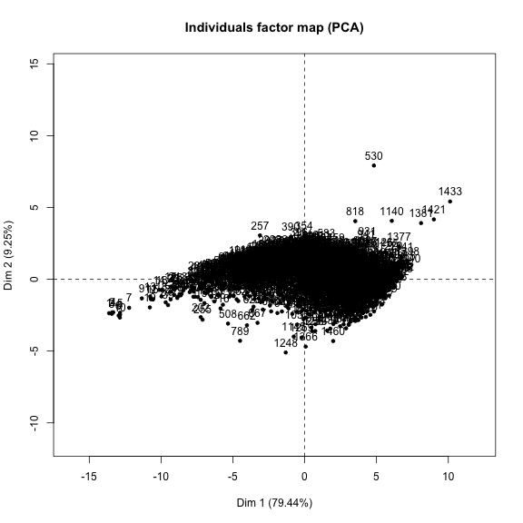

<!-- R Commander Markdown Template -->

SMDE - First Assignment
=======================

### Juan Pablo Royo Sales

### 2019-11-29


# Report and Code Organization

This assignment has been organized on the following way in order to find in a straightforward way all the resources needed.

## Folders

1. **src**: You can find here the Java code of RNG implemented.
2. **samples**: You can find here all the ***csv*** files that are being loaded by the Markdown script.
3. **report**: You can find here this markdown report alongside with the R script.

# Prerequistes

Although I have tried to reference all the path in the script and Markdown file with a relative path, I wasn't able to get it worked with relative path. I don't know if it is because of the version or the OS, which is an OSx, but they only way I was able to load ***csv*** files was with Absolute paths.

**You must need to change all the path in this file in order to run the script or Markdown**


# Question 1 - Assignment

## Loading data generated by Java Fib-Flagged method.

1. Load Data


```r
> fibflagged <- read.table("/Users/juan/Projects/upc/master/smde/smde-rng/samples/500_random_numbers.csv", 
+     header = FALSE, sep = ",", na.strings = "NA", dec = ".", strip.white = TRUE)
```

2. Apply bins


```r
> fibflagged$bins <- with(fibflagged, binVariable(V1, bins = 10, method = "intervals", 
+     labels = c("1", "2", "3", "4", "5", "6", "7", "8", "9", "10")))
```

```
Error in binVariable(V1, bins = 10, method = "intervals", labels = c("1", : unused arguments (V1, bins = 10, method = "intervals", labels = c("1", "2", "3", "4", "5", "6", "7", "8", "9", "10"))
```

3. Generate Frequency


```r
> fibflagged_trans <- as.data.frame(with(fibflagged, table(bins)))
```

```
Error in table(bins): object 'bins' not found
```


## Generating uniform distribution with R

1. Load data


```r
> distribution_r <- as.data.frame(matrix(runif(500 * 1, min = 0, max = 1), ncol = 1))
> rownames(distribution_r) <- paste("sample", 1:500, sep = "")
> colnames(distribution_r) <- "obs"
> distribution_r <- within(distribution_r, {
+     mean <- rowMeans(distribution_r[, 1:1])
+ })
```

```
Error in rowMeans(distribution_r[, 1:1]): 'x' must be an array of at least two dimensions
```

2. Apply bins


```r
> distribution_r$bins <- with(distribution_r, binVariable(obs, bins = 10, method = "intervals", 
+     labels = c("1", "2", "3", "4", "5", "6", "7", "8", "9", "10")))
```

```
Error in binVariable(obs, bins = 10, method = "intervals", labels = c("1", : unused arguments (obs, bins = 10, method = "intervals", labels = c("1", "2", "3", "4", "5", "6", "7", "8", "9", "10"))
```

3. Generate Frequency


```r
> distribution_r_trans <- as.data.frame(with(distribution_r, table(frequency)))
```

```
Error in unique.default(x, nmax = nmax): unique() applies only to vectors
```

## Merge both frequencies R and Fib-Flagged


```r
> merge_fibflagged_r_comb <- merge(fibflagged_trans, distribution_r_trans, all = TRUE, 
+     by = "row.names")
> rownames(merge_fibflagged_r_comb) <- merge_fibflagged_r_comb$Row.names
> merge_fibflagged_r_comb$Row.names <- NULL
```

## Generate table for Chi test


```r
> to_be_test_chi_r_fibflagged <- within(merge_fibflagged_r_comb, {
+ 	bins <- NULL
+ 	frequency <- NULL
+ })
```

## Run Chi Test


```r
> test <- chisq.test(to_be_test_chi_r_fibflagged, correct = FALSE)
```

### Conclusion Chi Test

After this **test** has a **p-value** of **0.819475004287325** , therefore with can deduce that we can accept the algorithm but for a number of 10 bins as it seems it is generating Random Numbers in an uniform distribution.


## Another test with 20 bins on each distribution

Now we are going to refrequence the bins to 20


```r
> fibflagged$morebins <- with(fibflagged, binVariable(V1, bins = 20, method = "intervals", 
+     labels = c("1", "2", "3", "4", "5", "6", "7", "8", "9", "10", "11", "12", "13", 
+         "14", "15", "16", "17", "18", "19", "20")))
```

```
Error in binVariable(V1, bins = 20, method = "intervals", labels = c("1", : unused arguments (V1, bins = 20, method = "intervals", labels = c("1", "2", "3", "4", "5", "6", "7", "8", "9", "10", "11", "12", "13", "14", "15", "16", "17", "18", "19", "20"))
```


```r
> distribution_r$morebins <- with(distribution_r, binVariable(obs, bins = 20, method = "intervals", 
+     labels = c("1", "2", "3", "4", "5", "6", "7", "8", "9", "10", "11", "12", "13", 
+         "14", "15", "16", "17", "18", "19", "20")))
```

```
Error in binVariable(obs, bins = 20, method = "intervals", labels = c("1", : unused arguments (obs, bins = 20, method = "intervals", labels = c("1", "2", "3", "4", "5", "6", "7", "8", "9", "10", "11", "12", "13", "14", "15", "16", "17", "18", "19", "20"))
```

## Count Frequency on 20 bins 

Count the frequency on each distribution


```r
> fibflagged_trans_20bins <- as.data.frame(with(fibflagged, table(morebins)))
```

```
Error in table(morebins): object 'morebins' not found
```


```r
> distribution_r_trans_20bins <- as.data.frame(with(distribution_r, table(morebins)))
```

```
Error in table(morebins): object 'morebins' not found
```

## Merge both frequency distribution with 20 bins


```r
> merge_fibflagged_r_comb_20bins <- merge(fibflagged_trans_20bins, distribution_r_trans_20bins, 
+     all = TRUE, by = "row.names")
```


```r
> rownames(merge_fibflagged_r_comb_20bins) <- merge_fibflagged_r_comb_20bins$Row.names
```


```r
> merge_fibflagged_r_comb_20bins$Row.names <- NULL
```

## Run Chi-square Test


```r
> test_chi_r_fibflagged_20bins <- within(merge_fibflagged_r_comb_20bins, {
+     morebins.x <- NULL
+     morebins.y <- NULL
+ })
```


```r
> chi_20bins <- chisq.test(test_chi_r_fibflagged_20bins, correct = FALSE)
```

### Conclusion Chi Test

After this **p-value** of **0.00175158290728414**, therefore with can deduce when we increase the beans the algorithm is not generating a random uniform distribution.


# Question 2 - Assignment


## Loading Normal distribution generated by code

1. Normal mu = 0, sigma = 1


```r
> Norm_m0_s1 <- read.table("/Users/juan/Projects/upc/master/smde/smde-rng/samples/1500_normal_mu_0_sigma_1.csv", 
+     header = FALSE, sep = ",", na.strings = "NA", dec = ".", strip.white = TRUE)
```

2. Normal mu = 10, sigma = 1


```r
> Norm_m10_s1 <- read.table("/Users/juan/Projects/upc/master/smde/smde-rng/samples/1500_normal_mu_10_sigma_1.csv", 
+     header = FALSE, sep = ",", na.strings = "NA", dec = ".", strip.white = TRUE)
```

3. Normal mu = 0, sigma = 1


```r
> Norm_m0_s1_2 <- read.table("/Users/juan/Projects/upc/master/smde/smde-rng/samples/1500_normal_mu_0_sigma_1_2.csv", 
+     header = FALSE, sep = ",", na.strings = "NA", dec = ".", strip.white = TRUE)
```


## Run Anova analysis


```r
> Norm_v1n = data.frame(x1 = Norm_m0_s1, x2 = "v1")
```


```r
> Norm_v2n = data.frame(x1 = Norm_m10_s1, x2 = "v2")
```


```r
> Norm_v3n = data.frame(x1 = Norm_m0_s1_2, x2 = "v3")
```


```r
> data = mergeRows(Norm_v1n, Norm_v2n, common.only = FALSE)
```


```r
> data = mergeRows(as.data.frame(data), Norm_v3n, common.only = FALSE)
```


```r
> AnovaModel.1 <- aov(V1 ~ x2, data = data)
```


```r
> summary(AnovaModel.1)
```

```
              Df Sum Sq Mean Sq F value Pr(>F)    
x2             2 100000   50000   49071 <2e-16 ***
Residuals   4497   4582       1                   
---
Signif. codes:  0 '***' 0.001 '**' 0.01 '*' 0.05 '.' 0.1 ' ' 1
```


```r
> Boxplot(V1 ~ x2, data = data, id.method = "y")
```


```
 [1] "122"  "141"  "620"  "700"  "1105" "1261" "1"    "1146" "1263" "1622"
[11] "1641" "2120" "2200" "2605" "2761" "1501" "2646" "2763" "3122" "3141"
[21] "3620" "3700" "4105" "4261" "3001" "4146" "4263"
```


### Conclusions Anova Analysis 

1. We already know beforehand that we have set 3 different populations which means are different, therefore the small p-value of **Pr(>F) <2e-16** and with a high **F value of 49071** which indicate rejection shows this.
2. For this part of the test we have proof our assumptions.


## Running Test for checking assumptions


```r
> library("lmtest", lib.loc = "~/R/win-library/3.0")
```

```
Error in library("lmtest", lib.loc = "~/R/win-library/3.0"): no library trees found in 'lib.loc'
```


```r
> dwtest(AnovaModel.1, alternative = "two.sided")
```

```
Error in dwtest(AnovaModel.1, alternative = "two.sided"): could not find function "dwtest"
```


```r
> shapiro.test(residuals(AnovaModel.1))
```

```

	Shapiro-Wilk normality test

data:  residuals(AnovaModel.1)
W = 0.99896, p-value = 0.006966
```


```r
> lmtest::bptest(AnovaModel.1)
```

```

	studentized Breusch-Pagan test

data:  AnovaModel.1
BP = 4.5352e-26, df = 2, p-value = 1
```


### Conclusion Test assumptions


After running Durbin Watson, Shapiro and Brewusch-Pagan tests we can state the following conclusions:

1. It has been tried different number size of Normal Distribution, first with 500 each, after with 3000 but in this case Shapiro doesn't support such a big number, and finally because of the amount restrictions it has been tested with 1500 samples each Distribution.
2. Regarding Durbin-Watson test, it has been shown that the observations doesn't seem independents at all with a **p-value** of **0.127**
3. In all cases Shapiro Test gave us a really small **p-value** of 0.006966, which it means that the Distribution doesn't seem normal. 
4. Finally for Homogeneity of variance with the last test it has been found out that **p-value** is **1** which means it is homogeneous. 

It can be deduced based on Question 1, that the RNG it is not so random, because in Question 1 when we increase the bins, we obtained a rejection area.

## Anova on Wine FactoMinerR Dataset

First we load the Wine Dataset


```r
> wine_data <- data(wine, package = "FactoMineR")
```

### Analysis of Soil regarding Odor Intensity before shaking


```r
> wine_data_soil_odori <- wine[, c("Odor.Intensity.before.shaking", "Soil")]
> colnames(wine_data_soil_odori) <- c("odori", "soil")
> AnovaModel_soil_odori <- aov(odori ~ soil, data = wine_data_soil_odori)
> summary(AnovaModel_soil_odori)
```

```
            Df Sum Sq Mean Sq F value  Pr(>F)   
soil         3 0.8950 0.29833   6.496 0.00397 **
Residuals   17 0.7807 0.04592                   
---
Signif. codes:  0 '***' 0.001 '**' 0.01 '*' 0.05 '.' 0.1 ' ' 1
```

Running the previous Anova Model on **Soil** taking the **factor of Odor Intensity before shaking** we obtain a small p-value of **Pr(>F) 0.00397** and with a **F value of 6.496** indicating that we can reject the null hypothesis, therefore the populations are different.
This means that different Soils are affecting the Odor intensity before shaking factor.


### Analysis of Soil regarding Aroma Quality before shaking


```r
> wine_data_soil_aromaq <- wine[, c("Aroma.quality.before.shaking", "Soil")]
> colnames(wine_data_soil_aromaq) <- c("aromaq", "soil")
> AnovaModel_soil_aromaq <- aov(aromaq ~ soil, data = wine_data_soil_aromaq)
> summary(AnovaModel_soil_aromaq)
```

```
            Df Sum Sq Mean Sq F value Pr(>F)  
soil         3 0.3512 0.11705   4.023 0.0248 *
Residuals   17 0.4946 0.02909                 
---
Signif. codes:  0 '***' 0.001 '**' 0.01 '*' 0.05 '.' 0.1 ' ' 1
```

Running the previous Anova Model on **Soil** taking the **factor of Aroma Quality before shaking** we obtain a small p-value of **Pr(>F) 0.0248** and with a **F value of 4.023** indicating that we can reject the null hypothesis, therefore the populations are different.
This means that different Soils are affecting the Aroma quality of the wine before shaking.


### Analysis of Label regarding Odor Intensity before shaking


```r
> wine_data_label_odori <- wine[, c("Odor.Intensity.before.shaking", "Label")]
> colnames(wine_data_label_odori) <- c("odori", "label")
> AnovaModel_label_odori <- aov(odori ~ label, data = wine_data_label_odori)
> summary(AnovaModel_label_odori)
```

```
            Df Sum Sq Mean Sq F value Pr(>F)  
label        2 0.5732 0.28658   4.679 0.0231 *
Residuals   18 1.1025 0.06125                 
---
Signif. codes:  0 '***' 0.001 '**' 0.01 '*' 0.05 '.' 0.1 ' ' 1
```

Running the previous Anova Model on **Label** taking the **factor of Odor Intensity before shaking** we obtain a small p-value of **Pr(>F) 0.0231** and with a **F value of 4.679** indicating that we can reject the null hypothesis, therefore the populations are different.
This means that different Labels are also affecting the Odor intensity before shaking factor.


### Analysis of Label regarding Aroma Quality before shaking


```r
> wine_data_label_aromaq <- wine[, c("Aroma.quality.before.shaking", "Label")]
> colnames(wine_data_label_aromaq) <- c("aromaq", "label")
> AnovaModel_label_aromaq <- aov(aromaq ~ label, data = wine_data_label_aromaq)
> summary(AnovaModel_label_aromaq)
```

```
            Df Sum Sq Mean Sq F value Pr(>F)
label        2 0.1438 0.07189   1.843  0.187
Residuals   18 0.7020 0.03900               
```


Running the previous Anova Model on **Label** taking the **factor of Aroma Quality before shaking** we obtain a small p-value of **Pr(>F) 0.187** and with a **F value of 1.843** indicating that we can reject the null hypothesis, therefore the populations are different.
This means that different Labels are also affecting the Aroma quality of the wine before shaking.


### Conclusions ANOVA on wine FactoMineR

It seems that both are features Label and Soil are affecting wine factors. Although this, we can state from the analysis above that in the case of **Label** feature for Aroma Quality before shaking,
it is not affecting so much as the other because in spite the *p-value* is small it is near 0.20 which indicates that the populations are more similar in means than the other cases.


# Question 3 - Assignment

## Decathlon Data

### Loading data


```r
> data(decathlon, package = "FactoMineR")
> names(decathlon) <- make.names(names(decathlon))
```

### Splitting Data - Training and Test


```r
> if (!require("caTools")) {
+     install.packages("caTools")
+     library(caTools)
+ }
> split = sample.split(decathlon, SplitRatio = 0.6)
> training_decathlon_set = subset(decathlon, split == TRUE)
> test_decathlon_set = subset(decathlon, split == FALSE)
```

## Analyzing Data

### First Scenario of 1500m with all Variables


```r
> names(training_decathlon_set) <- make.names(names(training_decathlon_set))
> RegModel.17 <- lm(X1500m ~ Discus + High.jump + Javeline + Long.jump + Points + Pole.vault + 
+     Rank + Shot.put + X100m + X110m.hurdle + X400m, data = training_decathlon_set)
> summary(RegModel.17)
```

```

Call:
lm(formula = X1500m ~ Discus + High.jump + Javeline + Long.jump + 
    Points + Pole.vault + Rank + Shot.put + X100m + X110m.hurdle + 
    X400m, data = training_decathlon_set)

Residuals:
     Min       1Q   Median       3Q      Max 
-0.75567 -0.27935 -0.03695  0.38896  0.68330 

Coefficients:
                Estimate  Std. Error t value Pr(>|t|)    
(Intercept)  1447.145234   34.400872  42.067 1.21e-11 ***
Discus          3.408532    0.107806  31.617 1.55e-10 ***
High.jump     148.098133    4.761908  31.101 1.80e-10 ***
Javeline        2.436085    0.104335  23.349 2.31e-09 ***
Long.jump      39.328510    1.468616  26.779 6.83e-10 ***
Points         -0.165055    0.003721 -44.357 7.52e-12 ***
Pole.vault     48.595723    1.267929  38.327 2.78e-11 ***
Rank           -0.040828    0.040192  -1.016    0.336    
Shot.put       10.136412    0.461202  21.978 3.95e-09 ***
X100m         -38.093487    1.239315 -30.738 2.00e-10 ***
X110m.hurdle  -19.814423    0.681331 -29.082 3.28e-10 ***
X400m          -7.813479    0.422119 -18.510 1.80e-08 ***
---
Signif. codes:  0 '***' 0.001 '**' 0.01 '*' 0.05 '.' 0.1 ' ' 1

Residual standard error: 0.6661 on 9 degrees of freedom
Multiple R-squared:  0.9987,	Adjusted R-squared:  0.9972 
F-statistic: 646.1 on 11 and 9 DF,  p-value: 1.2e-11
```

We can see based on the results that the rank is not affecting the model, so we can remove it.


```r
> RegModel.18 <- lm(X1500m ~ Discus + High.jump + Javeline + Long.jump + Points + Pole.vault + 
+     Shot.put + X100m + X110m.hurdle + X400m, data = training_decathlon_set)
> summary(RegModel.18)
```

```

Call:
lm(formula = X1500m ~ Discus + High.jump + Javeline + Long.jump + 
    Points + Pole.vault + Shot.put + X100m + X110m.hurdle + X400m, 
    data = training_decathlon_set)

Residuals:
    Min      1Q  Median      3Q     Max 
-0.7959 -0.2869 -0.1045  0.3446  0.9806 

Coefficients:
                Estimate  Std. Error t value Pr(>|t|)    
(Intercept)  1441.537295   34.009122   42.39 1.28e-12 ***
Discus          3.419058    0.107478   31.81 2.22e-11 ***
High.jump     150.500999    4.139438   36.36 5.89e-12 ***
Javeline        2.474221    0.097502   25.38 2.07e-10 ***
Long.jump      40.065826    1.278749   31.33 2.58e-11 ***
Points         -0.165929    0.003626  -45.76 5.98e-13 ***
Pole.vault     49.271546    1.081083   45.58 6.23e-13 ***
Shot.put       10.257396    0.446269   22.98 5.49e-10 ***
X100m         -37.560796    1.124693  -33.40 1.37e-11 ***
X110m.hurdle  -19.964796    0.666115  -29.97 4.00e-11 ***
X400m          -8.001487    0.379985  -21.06 1.30e-09 ***
---
Signif. codes:  0 '***' 0.001 '**' 0.01 '*' 0.05 '.' 0.1 ' ' 1

Residual standard error: 0.6671 on 10 degrees of freedom
Multiple R-squared:  0.9986,	Adjusted R-squared:  0.9972 
F-statistic: 708.3 on 10 and 10 DF,  p-value: 6.985e-13
```

Here we have a very good model to predict the next results. We have an slope since the **p-value** has a small value **4.842e-14**

Lets try to remove Points to see what happen with the model


```r
> RegModel.19 <- lm(X1500m ~ Discus + High.jump + Javeline + Long.jump + Pole.vault + 
+     Shot.put + X100m + X110m.hurdle + X400m, data = training_decathlon_set)
> summary(RegModel.19)
```

```

Call:
lm(formula = X1500m ~ Discus + High.jump + Javeline + Long.jump + 
    Pole.vault + Shot.put + X100m + X110m.hurdle + X400m, data = training_decathlon_set)

Residuals:
    Min      1Q  Median      3Q     Max 
-11.907  -4.967   1.173   2.632  13.408 

Coefficients:
             Estimate Std. Error t value Pr(>|t|)  
(Intercept)  167.5466   270.1669   0.620   0.5478  
Discus         1.3457     1.3479   0.998   0.3396  
High.jump      1.8028    35.4678   0.051   0.9604  
Javeline      -1.5043     0.6105  -2.464   0.0314 *
Long.jump     -6.7143    10.6253  -0.632   0.5404  
Pole.vault    11.6343     9.7041   1.199   0.2558  
Shot.put      -1.0296     5.1438  -0.200   0.8450  
X100m        -19.8161    14.6014  -1.357   0.2019  
X110m.hurdle   1.5846     6.5159   0.243   0.8123  
X400m          6.8391     2.7390   2.497   0.0297 *
---
Signif. codes:  0 '***' 0.001 '**' 0.01 '*' 0.05 '.' 0.1 ' ' 1

Residual standard error: 9.227 on 11 degrees of freedom
Multiple R-squared:  0.7033,	Adjusted R-squared:  0.4606 
F-statistic: 2.898 on 9 and 11 DF,  p-value: 0.04991
```

We can see that if we remove points, we dont have almost relation between the variables to explain the model. Lets add Points again and remove other Variable to see if the relations stay still.


```r
> RegModel.21 <- lm(X1500m ~ Discus + High.jump + Long.jump + Points + Pole.vault + 
+     Shot.put + X100m + X110m.hurdle + X400m, data = training_decathlon_set)
> summary(RegModel.21)
```

```

Call:
lm(formula = X1500m ~ Discus + High.jump + Long.jump + Points + 
    Pole.vault + Shot.put + X100m + X110m.hurdle + X400m, data = training_decathlon_set)

Residuals:
    Min      1Q  Median      3Q     Max 
-8.7892 -1.0899  0.1814  2.4568  6.6563 

Coefficients:
              Estimate Std. Error t value  Pr(>|t|)    
(Intercept)  849.29392  190.73436   4.453  0.000974 ***
Discus         1.80531    0.66807   2.702  0.020573 *  
High.jump     74.80142   22.12777   3.380  0.006138 ** 
Long.jump     16.78052    6.86703   2.444  0.032612 *  
Points        -0.08388    0.01266  -6.628 0.0000372 ***
Pole.vault    28.64042    5.49419   5.213  0.000289 ***
Shot.put       6.68190    3.26490   2.047  0.065359 .  
X100m        -25.00743    7.78795  -3.211  0.008290 ** 
X110m.hurdle -10.56138    4.26793  -2.475  0.030869 *  
X400m         -1.05387    2.03167  -0.519  0.614229    
---
Signif. codes:  0 '***' 0.001 '**' 0.01 '*' 0.05 '.' 0.1 ' ' 1

Residual standard error: 5.144 on 11 degrees of freedom
Multiple R-squared:  0.9078,	Adjusted R-squared:  0.8324 
F-statistic: 12.03 on 9 and 11 DF,  p-value: 0.0001651
```

We can see again if we keep Points and remove other like Javaline, we again couldn't have a model to do predictions. We are going to add again Javaline.


```r
> RegModel.23 <- lm(X1500m ~ Discus + High.jump + Javeline + Long.jump + Points + Pole.vault + 
+     Shot.put + X100m + X110m.hurdle + X400m, data = training_decathlon_set)
> summary(RegModel.23)
```

```

Call:
lm(formula = X1500m ~ Discus + High.jump + Javeline + Long.jump + 
    Points + Pole.vault + Shot.put + X100m + X110m.hurdle + X400m, 
    data = training_decathlon_set)

Residuals:
    Min      1Q  Median      3Q     Max 
-0.7959 -0.2869 -0.1045  0.3446  0.9806 

Coefficients:
                Estimate  Std. Error t value Pr(>|t|)    
(Intercept)  1441.537295   34.009122   42.39 1.28e-12 ***
Discus          3.419058    0.107478   31.81 2.22e-11 ***
High.jump     150.500999    4.139438   36.36 5.89e-12 ***
Javeline        2.474221    0.097502   25.38 2.07e-10 ***
Long.jump      40.065826    1.278749   31.33 2.58e-11 ***
Points         -0.165929    0.003626  -45.76 5.98e-13 ***
Pole.vault     49.271546    1.081083   45.58 6.23e-13 ***
Shot.put       10.257396    0.446269   22.98 5.49e-10 ***
X100m         -37.560796    1.124693  -33.40 1.37e-11 ***
X110m.hurdle  -19.964796    0.666115  -29.97 4.00e-11 ***
X400m          -8.001487    0.379985  -21.06 1.30e-09 ***
---
Signif. codes:  0 '***' 0.001 '**' 0.01 '*' 0.05 '.' 0.1 ' ' 1

Residual standard error: 0.6671 on 10 degrees of freedom
Multiple R-squared:  0.9986,	Adjusted R-squared:  0.9972 
F-statistic: 708.3 on 10 and 10 DF,  p-value: 6.985e-13
```

### Testing assumptions on this linear model

1. Durbin Watson Test for independence


```r
> library("lmtest", lib.loc = "~/R/win-library/3.0")
```

```
Error in library("lmtest", lib.loc = "~/R/win-library/3.0"): no library trees found in 'lib.loc'
```

```r
> dwtest(RegModel.23, alternative = "two.sided")
```

```
Error in dwtest(RegModel.23, alternative = "two.sided"): could not find function "dwtest"
```

We can see that the Regression Model pass the independence test with a p-value of **0.3621**

2. Shapiro Test for Normality 


```r
> shapiro.test(residuals(RegModel.23))
```

```

	Shapiro-Wilk normality test

data:  residuals(RegModel.23)
W = 0.97885, p-value = 0.908
```

We can see that the distribution is a Normal distribution with a p-value of **0.5407**

2. Brewusch Pagan Test - Homogeneity of the Variance


```r
> bptest(RegModel.23)
```

```
Error in bptest(RegModel.23): could not find function "bptest"
```

We can see here that since the p-value is small **0.2054**, although not too much, the variance seems homogeneous.


### Predictions


```r
> prediction <- predict(RegModel.23, newdata = test_decathlon_set, interval = "prediction")
> prediction
```

```
                 fit      lwr      upr
SEBRLE      292.2176 290.0580 294.3772
CLAY        301.5143 298.9819 304.0466
WARNERS     278.5217 276.3166 280.7267
ZSIVOCZKY   267.6407 265.7668 269.5146
MARTINEAU   260.8980 258.3778 263.4183
BARRAS      282.8280 280.7526 284.9035
Sebrle      279.3451 276.7864 281.9039
Clay        280.6277 277.7375 283.5178
Zsivoczky   269.6649 267.8356 271.4942
Hernu       264.5041 262.7559 266.2522
Bernard     276.3448 274.5777 278.1118
Pogorelov   287.6768 285.6755 289.6781
Smith       272.1997 269.6682 274.7313
Averyanov   271.1250 269.0356 273.2143
Drews       273.9247 271.9125 275.9368
Parkhomenko 277.7188 275.5207 279.9169
Gomez       269.4581 266.9807 271.9354
Lorenzo     262.3527 260.3358 264.3696
Uldal       281.6464 279.7832 283.5095
Casarsa     294.2288 291.9934 296.4641
```

Lets compare with the Real data


```r
> test_only_with_x1500m <- subset(test_decathlon_set, select = c("X1500m"))
> test_only_with_x1500m
```

```
            X1500m
SEBRLE      291.70
CLAY        301.50
WARNERS     278.10
ZSIVOCZKY   268.00
MARTINEAU   262.10
BARRAS      282.00
Sebrle      280.01
Clay        282.00
Zsivoczky   269.54
Hernu       264.35
Bernard     276.31
Pogorelov   287.63
Smith       272.74
Averyanov   271.02
Drews       274.21
Parkhomenko 277.94
Gomez       269.70
Lorenzo     263.08
Uldal       281.70
Casarsa     296.12
```


```r
> predicted_data <- data.frame(prediction)
> predicted_data["real_data_x1500m"] = test_only_with_x1500m["X1500m"]
> predicted_data
```

```
                 fit      lwr      upr real_data_x1500m
SEBRLE      292.2176 290.0580 294.3772           291.70
CLAY        301.5143 298.9819 304.0466           301.50
WARNERS     278.5217 276.3166 280.7267           278.10
ZSIVOCZKY   267.6407 265.7668 269.5146           268.00
MARTINEAU   260.8980 258.3778 263.4183           262.10
BARRAS      282.8280 280.7526 284.9035           282.00
Sebrle      279.3451 276.7864 281.9039           280.01
Clay        280.6277 277.7375 283.5178           282.00
Zsivoczky   269.6649 267.8356 271.4942           269.54
Hernu       264.5041 262.7559 266.2522           264.35
Bernard     276.3448 274.5777 278.1118           276.31
Pogorelov   287.6768 285.6755 289.6781           287.63
Smith       272.1997 269.6682 274.7313           272.74
Averyanov   271.1250 269.0356 273.2143           271.02
Drews       273.9247 271.9125 275.9368           274.21
Parkhomenko 277.7188 275.5207 279.9169           277.94
Gomez       269.4581 266.9807 271.9354           269.70
Lorenzo     262.3527 260.3358 264.3696           263.08
Uldal       281.6464 279.7832 283.5095           281.70
Casarsa     294.2288 291.9934 296.4641           296.12
```

As we can appreciate all the real values of the test data set are between the interval **lwr** and **upr**, which indicates that the prediction was properly done, because the model with the trained data was accurate.

# Question 4 - Assignment

## PCA - Decathlon


```r
> decathlon.PCA <- decathlon[, c("X100m", "Long.jump", "Shot.put", "High.jump", "X400m", 
+     "X110m.hurdle", "Discus", "Pole.vault", "Javeline", "X1500m", "Rank", "Points")]
> res <- PCA(decathlon.PCA, scale.unit = TRUE, ncp = 5, graph = FALSE)
> plot.PCA(res, axes = c(1, 2), choix = "ind", habillage = "none", col.ind = "black", 
+     col.ind.sup = "blue", col.quali = "magenta", label = c("ind", "ind.sup", "quali"), 
+     new.plot = TRUE)
```


```r
> plot.PCA(res, axes = c(1, 2), choix = "var", new.plot = TRUE, col.var = "black", 
+     col.quanti.sup = "blue", label = c("var", "quanti.sup"), lim.cos2.var = 0)
```


```r
> summary(res, nb.dec = 3, nbelements = 10, nbind = 10, ncp = 3, file = "")
```

```

Call:
PCA(X = decathlon.PCA, scale.unit = TRUE, ncp = 5, graph = FALSE) 


Eigenvalues
                       Dim.1   Dim.2   Dim.3   Dim.4   Dim.5   Dim.6
Variance               4.759   1.740   1.415   1.132   0.862   0.607
% of var.             39.657  14.501  11.791   9.431   7.183   5.061
Cumulative % of var.  39.657  54.158  65.949  75.380  82.563  87.624
                       Dim.7   Dim.8   Dim.9  Dim.10  Dim.11  Dim.12
Variance               0.510   0.411   0.235   0.187   0.141   0.000
% of var.              4.254   3.426   1.960   1.561   1.175   0.000
Cumulative % of var.  91.878  95.303  97.264  98.825 100.000 100.000

Individuals (the 10 first)
                 Dist    Dim.1    ctr   cos2    Dim.2    ctr   cos2  
SEBRLE       |  2.833 |  1.505  1.161  0.282 |  0.704  0.694  0.062 |
CLAY         |  3.754 |  1.557  1.243  0.172 |  0.555  0.432  0.022 |
KARPOV       |  3.602 |  1.600  1.312  0.197 |  0.463  0.300  0.016 |
BERNARD      |  2.957 |  0.082  0.003  0.001 | -0.978  1.340  0.109 |
YURKOV       |  3.154 | -0.039  0.001  0.000 |  2.051  5.894  0.423 |
WARNERS      |  2.552 |  0.631  0.204  0.061 | -1.719  4.142  0.454 |
ZSIVOCZKY    |  2.645 |  0.422  0.091  0.025 | -1.091  1.667  0.170 |
McMULLEN     |  2.615 |  0.576  0.170  0.048 |  0.249  0.087  0.009 |
MARTINEAU    |  3.811 | -1.687  1.458  0.196 |  0.455  0.290  0.014 |
HERNU        |  2.921 | -1.506  1.162  0.266 |  0.405  0.230  0.019 |
              Dim.3    ctr   cos2  
SEBRLE        0.942  1.529  0.111 |
CLAY          2.189  8.261  0.340 |
KARPOV        2.057  7.294  0.326 |
BERNARD       0.972  1.630  0.108 |
YURKOV       -1.072  1.980  0.115 |
WARNERS       0.826  1.176  0.105 |
ZSIVOCZKY    -1.225  2.588  0.214 |
McMULLEN     -0.377  0.245  0.021 |
MARTINEAU    -0.581  0.582  0.023 |
HERNU         0.930  1.491  0.101 |

Variables (the 10 first)
                Dim.1    ctr   cos2    Dim.2    ctr   cos2    Dim.3    ctr
X100m        | -0.708 10.538  0.501 |  0.158  1.428  0.025 | -0.154  1.685
Long.jump    |  0.756 12.007  0.571 | -0.333  6.369  0.111 |  0.182  2.347
Shot.put     |  0.612  7.862  0.374 |  0.612 21.542  0.375 | -0.020  0.028
High.jump    |  0.588  7.263  0.346 |  0.360  7.436  0.129 | -0.239  4.041
X400m        | -0.695 10.158  0.483 |  0.555 17.675  0.308 |  0.131  1.222
X110m.hurdle | -0.703 10.398  0.495 |  0.205  2.415  0.042 | -0.081  0.464
Discus       |  0.529  5.889  0.280 |  0.619 21.995  0.383 |  0.055  0.211
Pole.vault   |  0.145  0.441  0.021 | -0.202  2.336  0.041 |  0.704 35.050
Javeline     |  0.319  2.138  0.102 |  0.322  5.955  0.104 | -0.390 10.776
X1500m       | -0.105  0.231  0.011 |  0.469 12.647  0.220 |  0.782 43.199
               cos2  
X100m         0.024 |
Long.jump     0.033 |
Shot.put      0.000 |
High.jump     0.057 |
X400m         0.017 |
X110m.hurdle  0.007 |
Discus        0.003 |
Pole.vault    0.496 |
Javeline      0.152 |
X1500m        0.611 |
```

```r
> remove(decathlon.PCA)
```

Taking into consideration this result we can state the following conclusions:

- **X110m hurdle**, **X100m** and **Rank** are correlated. There is also a correlation with **X400m** but not so strong as the others. Also there is a negative correlation between those and **Points**. 
This means that this type of competition which requires **strength** are related, which means that any athlete who has this quality is able to perform well in any of these trials.
- **Discuss**, **Javaline**, **Shot.put** are also correlated alongside with **High.jump**. Taking the same analysis as before we can see that these type of proves are related because all of them requires 
**agility** as quality to perform well on all of this.
- **Long.jump** and **Pole.vault** are not correlated with any of the others and it could be explaining that this kind of trials requires different capabilities such as agility and strength.
- Regarding **X1500m** which has been our point of analysis in the previous Question, we can see that also is not correlated with any other dimension. That explain why we need everything to do the prediction.


## Analysis Boston Marathon Results - 2017

For the analysis i am going to take Men between 30 and 40 years old. 

Lets first take a sample and perform an ANOVA analysis in order to check if the population is Normal.


### ANOVA Analysis


```r
> boston_mar_men_30_40_training <- read.table("/Users/juan/Projects/upc/master/smde/smde-rng/samples/boston_marathon_men_30_40_training.csv", 
+     header = TRUE, sep = ",", na.strings = "NA", dec = ".", strip.white = TRUE, quote = "\"")
> boston_mar_men_18_30 <- read.table("/Users/juan/Projects/upc/master/smde/smde-rng/samples/boston_marathon_men_18_30.csv", 
+     header = TRUE, sep = ",", na.strings = "NA", dec = ".", strip.white = TRUE, quote = "\"")
> boston_mar_men_40_50 <- read.table("/Users/juan/Projects/upc/master/smde/smde-rng/samples/boston_marathon_men_40_50.csv", 
+     header = TRUE, sep = ",", na.strings = "NA", dec = ".", strip.white = TRUE, quote = "\"")
```


```r
> boston_mar_men_30_40_official_time = boston_mar_men_30_40_training[, c("Official.Time")]
> boston_mar_men_18_30_official_time = boston_mar_men_18_30[, c("Official.Time")]
> boston_mar_men_40_50_official_time = boston_mar_men_40_50[, c("Official.Time")]
> Norm_boston_mar_30_40 = data.frame(x1 = boston_mar_men_30_40_official_time, x2 = "men_30_40")
> Norm_boston_mar_30_40 = data.frame(x1 = boston_mar_men_30_40_official_time, x2 = "men_30_40")
> Norm_boston_mar_18_30 = data.frame(x1 = boston_mar_men_18_30_official_time, x2 = "men_18_30")
> Norm_boston_mar_40_50 = data.frame(x1 = boston_mar_men_40_50_official_time, x2 = "men_40_50")
> boston_mar_merge = mergeRows(Norm_boston_mar_30_40, Norm_boston_mar_18_30, common.only = FALSE)
> boston_mar_merge = mergeRows(as.data.frame(boston_mar_merge), Norm_boston_mar_40_50, 
+     common.only = FALSE)
> boston_mar_merge$x1 = as.difftime(as.character(boston_mar_merge$x1))
> boston_mar_merge$x1 = as.numeric(boston_mar_merge$x1, units = "secs")
> AnovaModel.Boston.Marathon.Merge <- aov(x1 ~ x2, data = boston_mar_merge)
```

Unfortunately as we can see the populations are different because **p-value** is too small. I have tried different ones but it seems obvious that the age is a predominant factor
in terms of performance and because of that the distributions between different ages for men have large variability, therefore ANOVA analysis indicates that does not belong to the same population.


```r
> library("lmtest", lib.loc = "~/R/win-library/3.0")
```

```
Error in library("lmtest", lib.loc = "~/R/win-library/3.0"): no library trees found in 'lib.loc'
```

```r
> dwtest(AnovaModel.Boston.Marathon.Merge, alternative = "two.sided")
```

```
Error in dwtest(AnovaModel.Boston.Marathon.Merge, alternative = "two.sided"): could not find function "dwtest"
```

```r
> lmtest::bptest(AnovaModel.Boston.Marathon.Merge)
```

```

	studentized Breusch-Pagan test

data:  AnovaModel.Boston.Marathon.Merge
BP = 422.6, df = 2, p-value < 2.2e-16
```

Regarding Testing we can see that it doesn't pass the test neither of homoscedasticity, independence and homogeneity of the variance.

Although this we are going to try to solve the Linear regression Model.


### Linear Regression Model


```r
> boston_mar_men_30_40_training$X5K = as.difftime(as.character(boston_mar_men_30_40_training$X5K))
> boston_mar_men_30_40_training$X5K = as.numeric(boston_mar_men_30_40_training$X5K, 
+     units = "secs")
> boston_mar_men_30_40_training$X10K = as.difftime(as.character(boston_mar_men_30_40_training$X10K))
> boston_mar_men_30_40_training$X10K = as.numeric(boston_mar_men_30_40_training$X10K, 
+     units = "secs")
> boston_mar_men_30_40_training$X15K = as.difftime(as.character(boston_mar_men_30_40_training$X15K))
> boston_mar_men_30_40_training$X15K = as.numeric(boston_mar_men_30_40_training$X15K, 
+     units = "secs")
> boston_mar_men_30_40_training$X20K = as.difftime(as.character(boston_mar_men_30_40_training$X20K))
> boston_mar_men_30_40_training$X20K = as.numeric(boston_mar_men_30_40_training$X20K, 
+     units = "secs")
> boston_mar_men_30_40_training$Half = as.difftime(as.character(boston_mar_men_30_40_training$Half))
> boston_mar_men_30_40_training$Half = as.numeric(boston_mar_men_30_40_training$Half, 
+     units = "secs")
> boston_mar_men_30_40_training$X25K = as.difftime(as.character(boston_mar_men_30_40_training$X25K))
> boston_mar_men_30_40_training$X25K = as.numeric(boston_mar_men_30_40_training$X25K, 
+     units = "secs")
> boston_mar_men_30_40_training$X30K = as.difftime(as.character(boston_mar_men_30_40_training$X30K))
> boston_mar_men_30_40_training$X30K = as.numeric(boston_mar_men_30_40_training$X30K, 
+     units = "secs")
> boston_mar_men_30_40_training$X35K = as.difftime(as.character(boston_mar_men_30_40_training$X35K))
> boston_mar_men_30_40_training$X35K = as.numeric(boston_mar_men_30_40_training$X35K, 
+     units = "secs")
> boston_mar_men_30_40_training$X40K = as.difftime(as.character(boston_mar_men_30_40_training$X40K))
> boston_mar_men_30_40_training$X40K = as.numeric(boston_mar_men_30_40_training$X40K, 
+     units = "secs")
> boston_mar_men_30_40_training$Pace = as.difftime(as.character(boston_mar_men_30_40_training$Pace))
> boston_mar_men_30_40_training$Pace = as.numeric(boston_mar_men_30_40_training$Pace, 
+     units = "secs")
> boston_mar_men_30_40_training$Official.Time = as.difftime(as.character(boston_mar_men_30_40_training$Official.Time))
> boston_mar_men_30_40_training$Official.Time = as.numeric(boston_mar_men_30_40_training$Official.Time, 
+     units = "secs")
```


```r
> RegModel.boston_mar_men_30_40.1 <- lm(Official.Time ~ Age + Bib + Division + Gender + 
+     Half + Overall + Pace + X + X5K + X10K + X15K + X20K + X25K + X30K + X35K + X40K, 
+     data = boston_mar_men_30_40_training)
> summary(RegModel.boston_mar_men_30_40.1)
```

```

Call:
lm(formula = Official.Time ~ Age + Bib + Division + Gender + 
    Half + Overall + Pace + X + X5K + X10K + X15K + X20K + X25K + 
    X30K + X35K + X40K, data = boston_mar_men_30_40_training)

Residuals:
     Min       1Q   Median       3Q      Max 
-17.0086  -6.4363   0.0441   6.2159  25.4287 

Coefficients: (1 not defined because of singularities)
               Estimate  Std. Error t value  Pr(>|t|)    
(Intercept)  6.26694774 13.61944423   0.460   0.64548    
Age          0.03082808  0.07245984   0.425   0.67057    
Bib         -0.00008608  0.00008479  -1.015   0.31016    
Division     0.02242614  0.01380032   1.625   0.10437    
Gender      -0.04068106  0.02828438  -1.438   0.15057    
Half         0.00308607  0.04791912   0.064   0.94866    
Overall      0.02557653  0.01838998   1.391   0.16450    
Pace        25.67916887  0.10554507 243.301   < 2e-16 ***
X                    NA          NA      NA        NA    
X5K         -0.01075908  0.01975907  -0.545   0.58617    
X10K         0.03875714  0.02199881   1.762   0.07831 .  
X15K        -0.01474616  0.01851381  -0.796   0.42587    
X20K        -0.01688350  0.04942725  -0.342   0.73271    
X25K        -0.01019051  0.01310843  -0.777   0.43705    
X30K         0.02551276  0.00825635   3.090   0.00204 ** 
X35K        -0.01580289  0.00575416  -2.746   0.00610 ** 
X40K         0.02447150  0.00570663   4.288 0.0000192 ***
---
Signif. codes:  0 '***' 0.001 '**' 0.01 '*' 0.05 '.' 0.1 ' ' 1

Residual standard error: 7.572 on 1472 degrees of freedom
  (10 observations deleted due to missingness)
Multiple R-squared:  0.9999,	Adjusted R-squared:  0.9999 
F-statistic: 9.039e+05 on 15 and 1472 DF,  p-value: < 2.2e-16
```

```r
> RegModel.boston_mar_men_30_40.2 <- lm(Official.Time ~ X30K + X35K + X40K, data = boston_mar_men_30_40_training)
> summary(RegModel.boston_mar_men_30_40.2)
```

```

Call:
lm(formula = Official.Time ~ X30K + X35K + X40K, data = boston_mar_men_30_40_training)

Residuals:
    Min      1Q  Median      3Q     Max 
-193.59  -21.91   -4.85   13.12  977.49 

Coefficients:
            Estimate Std. Error t value Pr(>|t|)    
(Intercept) 48.11735   22.59871   2.129   0.0334 *  
X30K         0.02629    0.02407   1.092   0.2748    
X35K        -0.44335    0.03512 -12.623   <2e-16 ***
X40K         1.41936    0.01524  93.109   <2e-16 ***
---
Signif. codes:  0 '***' 0.001 '**' 0.01 '*' 0.05 '.' 0.1 ' ' 1

Residual standard error: 53.65 on 1493 degrees of freedom
  (1 observation deleted due to missingness)
Multiple R-squared:  0.9945,	Adjusted R-squared:  0.9945 
F-statistic: 9.011e+04 on 3 and 1493 DF,  p-value: < 2.2e-16
```

```r
> RegModel.boston_mar_men_30_40.3 <- lm(Official.Time ~ X35K + X40K, data = boston_mar_men_30_40_training)
> summary(RegModel.boston_mar_men_30_40.3)
```

```

Call:
lm(formula = Official.Time ~ X35K + X40K, data = boston_mar_men_30_40_training)

Residuals:
    Min      1Q  Median      3Q     Max 
-187.62  -22.16   -4.62   12.90  979.36 

Coefficients:
            Estimate Std. Error t value Pr(>|t|)    
(Intercept) 50.77776   22.46855    2.26    0.024 *  
X35K        -0.40764    0.01285  -31.71   <2e-16 ***
X40K         1.40746    0.01066  132.05   <2e-16 ***
---
Signif. codes:  0 '***' 0.001 '**' 0.01 '*' 0.05 '.' 0.1 ' ' 1

Residual standard error: 53.66 on 1494 degrees of freedom
  (1 observation deleted due to missingness)
Multiple R-squared:  0.9945,	Adjusted R-squared:  0.9945 
F-statistic: 1.352e+05 on 2 and 1494 DF,  p-value: < 2.2e-16
```

According to these linear regression models, the best fit is to take into consideration the last 2 sprints in which there is a strong correlation with the final performance or the Official Time.
This assumption would seem right because as runners we know the difficulty of the last 10 km of a marathon.

Lets run the test of the Linear Regression selected model.


```r
> library("lmtest", lib.loc = "~/R/win-library/3.0")
```

```
Error in library("lmtest", lib.loc = "~/R/win-library/3.0"): no library trees found in 'lib.loc'
```

```r
> dwtest(RegModel.boston_mar_men_30_40.3, alternative = "two.sided")
```

```
Error in dwtest(RegModel.boston_mar_men_30_40.3, alternative = "two.sided"): could not find function "dwtest"
```

```r
> shapiro.test(residuals(RegModel.boston_mar_men_30_40.3))
```

```

	Shapiro-Wilk normality test

data:  residuals(RegModel.boston_mar_men_30_40.3)
W = 0.6875, p-value < 2.2e-16
```

```r
> bptest(RegModel.boston_mar_men_30_40.3)
```

```
Error in bptest(RegModel.boston_mar_men_30_40.3): could not find function "bptest"
```

As we can see by the results, there are correlation which we already knew because of the big **R-squared**
 value obtained, but we cannot be sure about independence and normality.

### Prediction with Test Data

Lets try to predict with the test data to see if the model fits.


```r
> boston_mar_men_30_40_test <- read.table("/Users/juan/Projects/upc/master/smde/smde-rng/samples/boston_marathon_men_30_40_test.csv", 
+     header = TRUE, sep = ",", na.strings = "NA", dec = ".", strip.white = TRUE, quote = "\"")
```


```r
> boston_mar_men_30_40_test$X5K = as.difftime(as.character(boston_mar_men_30_40_test$X5K))
> boston_mar_men_30_40_test$X5K = as.numeric(boston_mar_men_30_40_test$X5K, units = "secs")
> boston_mar_men_30_40_test$X10K = as.difftime(as.character(boston_mar_men_30_40_test$X10K))
> boston_mar_men_30_40_test$X10K = as.numeric(boston_mar_men_30_40_test$X10K, units = "secs")
> boston_mar_men_30_40_test$X15K = as.difftime(as.character(boston_mar_men_30_40_test$X15K))
> boston_mar_men_30_40_test$X15K = as.numeric(boston_mar_men_30_40_test$X15K, units = "secs")
> boston_mar_men_30_40_test$X20K = as.difftime(as.character(boston_mar_men_30_40_test$X20K))
> boston_mar_men_30_40_test$X20K = as.numeric(boston_mar_men_30_40_test$X20K, units = "secs")
> boston_mar_men_30_40_test$Half = as.difftime(as.character(boston_mar_men_30_40_test$Half))
> boston_mar_men_30_40_test$Half = as.numeric(boston_mar_men_30_40_test$Half, units = "secs")
> boston_mar_men_30_40_test$X25K = as.difftime(as.character(boston_mar_men_30_40_test$X25K))
> boston_mar_men_30_40_test$X25K = as.numeric(boston_mar_men_30_40_test$X25K, units = "secs")
> boston_mar_men_30_40_test$X30K = as.difftime(as.character(boston_mar_men_30_40_test$X30K))
> boston_mar_men_30_40_test$X30K = as.numeric(boston_mar_men_30_40_test$X30K, units = "secs")
> boston_mar_men_30_40_test$X35K = as.difftime(as.character(boston_mar_men_30_40_test$X35K))
> boston_mar_men_30_40_test$X35K = as.numeric(boston_mar_men_30_40_test$X35K, units = "secs")
> boston_mar_men_30_40_test$X40K = as.difftime(as.character(boston_mar_men_30_40_test$X40K))
> boston_mar_men_30_40_test$X40K = as.numeric(boston_mar_men_30_40_test$X40K, units = "secs")
> boston_mar_men_30_40_test$Pace = as.difftime(as.character(boston_mar_men_30_40_test$Pace))
> boston_mar_men_30_40_test$Pace = as.numeric(boston_mar_men_30_40_test$Pace, units = "secs")
> boston_mar_men_30_40_test$Official.Time = as.difftime(as.character(boston_mar_men_30_40_test$Official.Time))
> boston_mar_men_30_40_test$Official.Time = as.numeric(boston_mar_men_30_40_test$Official.Time, 
+     units = "secs")
```


```r
> prediction_boston_mar_men_30_40 <- predict(RegModel.boston_mar_men_30_40.3, newdata = boston_mar_men_30_40_test, 
+     interval = "prediction")
> # Showing only first 50
> head(prediction_boston_mar_men_30_40, n=50)
```

```
        fit      lwr      upr
1  12012.42 11907.05 12117.79
2  12023.64 11918.27 12129.01
3  11959.40 11854.02 12064.78
4  12064.51 11959.14 12169.88
5  12018.11 11912.68 12123.53
6  12049.36 11943.98 12154.73
7  11816.44 11711.02 11921.86
8  12026.59 11921.22 12131.96
9  12006.78 11901.42 12112.15
10 12064.22 11958.60 12169.85
11 12041.71 11936.26 12147.16
12 11882.58 11777.23 11987.93
13 12039.41 11934.01 12144.81
14 11990.47 11885.10 12095.84
15 12098.98 11993.60 12204.36
16 11990.65 11885.28 12096.03
17 11988.59 11883.23 12093.95
18 12076.01 11970.62 12181.40
19 12046.79 11941.40 12152.18
20 11989.97 11884.61 12095.33
21 12033.24 11927.22 12139.26
22 12011.93 11906.56 12117.29
23 12060.90 11955.52 12166.29
24 12020.03 11914.63 12125.42
25 11962.70 11857.33 12068.06
26 11916.68 11810.52 12022.83
27 12036.92 11931.49 12142.35
28 12017.28 11911.90 12122.66
29 11967.81 11862.43 12073.18
30 12021.44 11916.07 12126.81
31 12042.26 11936.84 12147.67
32 12053.40 11948.03 12158.78
33 12086.76 11981.23 12192.28
34 12037.61 11932.24 12142.99
35 11991.41 11886.04 12096.77
36 12019.34 11913.91 12124.77
37 12052.24 11946.86 12157.62
38 11992.70 11887.25 12098.14
39 12035.73 11930.21 12141.25
40 12333.67 12227.32 12440.02
41 12110.05 12004.67 12215.44
42 12080.19 11974.81 12185.58
43 12122.58 12017.19 12227.96
44 11953.87 11848.42 12059.32
45 12101.11 11995.73 12206.50
46 12138.27 12032.86 12243.68
47 12155.48 12050.08 12260.88
48 12058.35 11952.97 12163.73
49 11904.02 11798.60 12009.43
50 12204.44 12098.91 12309.97
```


```r
> prediction_boston_mar_men_30_40_data <- data.frame(prediction_boston_mar_men_30_40)
> # Showing only first 50
> head(prediction_boston_mar_men_30_40_data, n=50)
```

```
        fit      lwr      upr
1  12012.42 11907.05 12117.79
2  12023.64 11918.27 12129.01
3  11959.40 11854.02 12064.78
4  12064.51 11959.14 12169.88
5  12018.11 11912.68 12123.53
6  12049.36 11943.98 12154.73
7  11816.44 11711.02 11921.86
8  12026.59 11921.22 12131.96
9  12006.78 11901.42 12112.15
10 12064.22 11958.60 12169.85
11 12041.71 11936.26 12147.16
12 11882.58 11777.23 11987.93
13 12039.41 11934.01 12144.81
14 11990.47 11885.10 12095.84
15 12098.98 11993.60 12204.36
16 11990.65 11885.28 12096.03
17 11988.59 11883.23 12093.95
18 12076.01 11970.62 12181.40
19 12046.79 11941.40 12152.18
20 11989.97 11884.61 12095.33
21 12033.24 11927.22 12139.26
22 12011.93 11906.56 12117.29
23 12060.90 11955.52 12166.29
24 12020.03 11914.63 12125.42
25 11962.70 11857.33 12068.06
26 11916.68 11810.52 12022.83
27 12036.92 11931.49 12142.35
28 12017.28 11911.90 12122.66
29 11967.81 11862.43 12073.18
30 12021.44 11916.07 12126.81
31 12042.26 11936.84 12147.67
32 12053.40 11948.03 12158.78
33 12086.76 11981.23 12192.28
34 12037.61 11932.24 12142.99
35 11991.41 11886.04 12096.77
36 12019.34 11913.91 12124.77
37 12052.24 11946.86 12157.62
38 11992.70 11887.25 12098.14
39 12035.73 11930.21 12141.25
40 12333.67 12227.32 12440.02
41 12110.05 12004.67 12215.44
42 12080.19 11974.81 12185.58
43 12122.58 12017.19 12227.96
44 11953.87 11848.42 12059.32
45 12101.11 11995.73 12206.50
46 12138.27 12032.86 12243.68
47 12155.48 12050.08 12260.88
48 12058.35 11952.97 12163.73
49 11904.02 11798.60 12009.43
50 12204.44 12098.91 12309.97
```


```r
> boston_mar_30_40_test_only_with_official_time <- subset(boston_mar_men_30_40_test, 
+     select = c("Official.Time"))
> # Showing only first 50
> head(boston_mar_30_40_test_only_with_official_time, n=50)
```

```
   Official.Time
1          11993
2          11995
3          11996
4          11997
5          11998
6          11998
7          11999
8          11999
9          11999
10         12000
11         12003
12         12005
13         12006
14         12008
15         12009
16         12012
17         12012
18         12014
19         12016
20         12016
21         12017
22         12021
23         12023
24         12025
25         12029
26         12031
27         12031
28         12032
29         12032
30         12037
31         12038
32         12039
33         12040
34         12042
35         12043
36         12045
37         12047
38         12053
39         12062
40         12064
41         12065
42         12068
43         12069
44         12070
45         12071
46         12075
47         12075
48         12078
49         12079
50         12079
```


```r
> prediction_boston_mar_men_30_40_data["real_data_official_time"] = boston_mar_30_40_test_only_with_official_time["Official.Time"]
> # Showing only first 50
> head(prediction_boston_mar_men_30_40_data, n=50)
```

```
        fit      lwr      upr real_data_official_time
1  12012.42 11907.05 12117.79                   11993
2  12023.64 11918.27 12129.01                   11995
3  11959.40 11854.02 12064.78                   11996
4  12064.51 11959.14 12169.88                   11997
5  12018.11 11912.68 12123.53                   11998
6  12049.36 11943.98 12154.73                   11998
7  11816.44 11711.02 11921.86                   11999
8  12026.59 11921.22 12131.96                   11999
9  12006.78 11901.42 12112.15                   11999
10 12064.22 11958.60 12169.85                   12000
11 12041.71 11936.26 12147.16                   12003
12 11882.58 11777.23 11987.93                   12005
13 12039.41 11934.01 12144.81                   12006
14 11990.47 11885.10 12095.84                   12008
15 12098.98 11993.60 12204.36                   12009
16 11990.65 11885.28 12096.03                   12012
17 11988.59 11883.23 12093.95                   12012
18 12076.01 11970.62 12181.40                   12014
19 12046.79 11941.40 12152.18                   12016
20 11989.97 11884.61 12095.33                   12016
21 12033.24 11927.22 12139.26                   12017
22 12011.93 11906.56 12117.29                   12021
23 12060.90 11955.52 12166.29                   12023
24 12020.03 11914.63 12125.42                   12025
25 11962.70 11857.33 12068.06                   12029
26 11916.68 11810.52 12022.83                   12031
27 12036.92 11931.49 12142.35                   12031
28 12017.28 11911.90 12122.66                   12032
29 11967.81 11862.43 12073.18                   12032
30 12021.44 11916.07 12126.81                   12037
31 12042.26 11936.84 12147.67                   12038
32 12053.40 11948.03 12158.78                   12039
33 12086.76 11981.23 12192.28                   12040
34 12037.61 11932.24 12142.99                   12042
35 11991.41 11886.04 12096.77                   12043
36 12019.34 11913.91 12124.77                   12045
37 12052.24 11946.86 12157.62                   12047
38 11992.70 11887.25 12098.14                   12053
39 12035.73 11930.21 12141.25                   12062
40 12333.67 12227.32 12440.02                   12064
41 12110.05 12004.67 12215.44                   12065
42 12080.19 11974.81 12185.58                   12068
43 12122.58 12017.19 12227.96                   12069
44 11953.87 11848.42 12059.32                   12070
45 12101.11 11995.73 12206.50                   12071
46 12138.27 12032.86 12243.68                   12075
47 12155.48 12050.08 12260.88                   12075
48 12058.35 11952.97 12163.73                   12078
49 11904.02 11798.60 12009.43                   12079
50 12204.44 12098.91 12309.97                   12079
```

As we can see in some cases the real Official Time is not inside the interval predicted, but it is close enough to be a quite accurate prediction.

To finalize lets do a PCA (Principal Component Analysis) and check the results.

### PCA over Training Data


```r
> boston_mar_men_30_40_training.PCA <- boston_mar_men_30_40_training[, c("X", "Bib", 
+     "Age", "X5K", "X10K", "X15K", "X20K", "Half", "X25K", "X30K", "X35K", "X40K", 
+     "Pace", "Official.Time", "Overall", "Gender", "Division")]
> res <- PCA(boston_mar_men_30_40_training.PCA, scale.unit = TRUE, ncp = 5, graph = FALSE)
```

```
Warning in PCA(boston_mar_men_30_40_training.PCA, scale.unit = TRUE, ncp =
5, : Missing values are imputed by the mean of the variable: you should use
the imputePCA function of the missMDA package
```

```r
> plot.PCA(res, axes = c(1, 2), choix = "ind", habillage = "none", col.ind = "black", 
+     col.ind.sup = "blue", col.quali = "magenta", label = c("ind", "ind.sup", "quali"), 
+     new.plot = TRUE)
```



```r
> plot.PCA(res, axes = c(1, 2), choix = "var", new.plot = TRUE, col.var = "black", 
+     col.quanti.sup = "blue", label = c("var", "quanti.sup"), lim.cos2.var = 0)
```


```r
> summary(res, nb.dec = 3, nbelements = 10, nbind = 10, ncp = 3, file = "")
```

```

Call:
PCA(X = boston_mar_men_30_40_training.PCA, scale.unit = TRUE,  
     ncp = 5, graph = FALSE) 


Eigenvalues
                       Dim.1   Dim.2   Dim.3   Dim.4   Dim.5   Dim.6
Variance              13.505   1.573   0.945   0.685   0.162   0.082
% of var.             79.442   9.254   5.558   4.029   0.955   0.481
Cumulative % of var.  79.442  88.696  94.255  98.283  99.239  99.719
                       Dim.7   Dim.8   Dim.9  Dim.10  Dim.11  Dim.12
Variance               0.022   0.008   0.007   0.004   0.003   0.002
% of var.              0.127   0.048   0.039   0.026   0.016   0.013
Cumulative % of var.  99.846  99.894  99.933  99.958  99.974  99.987
                      Dim.13  Dim.14  Dim.15  Dim.16  Dim.17
Variance               0.002   0.001   0.000   0.000   0.000
% of var.              0.009   0.003   0.000   0.000   0.000
Cumulative % of var.  99.996 100.000 100.000 100.000 100.000

Individuals (the 10 first)
                   Dist     Dim.1     ctr    cos2     Dim.2     ctr
1             |  14.255 | -13.620   0.917   0.913 |  -2.363   0.237
2             |  14.003 | -13.416   0.890   0.918 |  -2.308   0.226
3             |  14.022 | -13.428   0.891   0.917 |  -2.406   0.246
4             |  13.910 | -13.330   0.878   0.918 |  -2.299   0.224
5             |  13.376 | -12.857   0.817   0.924 |  -2.333   0.231
6             |  13.495 | -12.957   0.830   0.922 |  -2.529   0.271
7             |  12.678 | -12.224   0.739   0.930 |  -1.986   0.167
8             |  13.407 | -12.860   0.817   0.920 |  -2.471   0.259
9             |  11.691 | -11.337   0.635   0.940 |  -1.332   0.075
10            |  13.413 | -12.869   0.819   0.921 |  -2.670   0.303
                 cos2     Dim.3     ctr    cos2  
1               0.027 |  -0.290   0.006   0.000 |
2               0.027 |   0.407   0.012   0.001 |
3               0.029 |   0.062   0.000   0.000 |
4               0.027 |   0.760   0.041   0.003 |
5               0.030 |   0.370   0.010   0.001 |
6               0.035 |   0.408   0.012   0.001 |
7               0.025 |   0.984   0.068   0.006 |
8               0.034 |   1.112   0.087   0.007 |
9               0.013 |   0.063   0.000   0.000 |
10              0.040 |   0.421   0.013   0.001 |

Variables (the 10 first)
                 Dim.1    ctr   cos2    Dim.2    ctr   cos2    Dim.3
X             |  0.900  6.003  0.811 | -0.399 10.099  0.159 |  0.057
Bib           |  0.515  1.965  0.265 |  0.376  8.963  0.141 |  0.003
Age           |  0.199  0.295  0.040 |  0.227  3.270  0.051 |  0.952
X5K           |  0.878  5.707  0.771 |  0.414 10.873  0.171 | -0.096
X10K          |  0.906  6.073  0.820 |  0.384  9.386  0.148 | -0.082
X15K          |  0.928  6.370  0.860 |  0.342  7.424  0.117 | -0.068
X20K          |  0.949  6.667  0.900 |  0.279  4.934  0.078 | -0.053
Half          |  0.951  6.698  0.905 |  0.271  4.659  0.073 | -0.052
X25K          |  0.965  6.893  0.931 |  0.206  2.690  0.042 | -0.041
X30K          |  0.980  7.117  0.961 |  0.098  0.608  0.010 | -0.025
                 ctr   cos2  
X              0.348  0.003 |
Bib            0.001  0.000 |
Age           95.832  0.906 |
X5K            0.969  0.009 |
X10K           0.713  0.007 |
X15K           0.489  0.005 |
X20K           0.292  0.003 |
Half           0.285  0.003 |
X25K           0.179  0.002 |
X30K           0.068  0.001 |
```

As we can see in the PCA, the model for prediction was selected wrongly because the most correlated variables are **30k and 35k** and we have chosen 35 and 40. 
Lets revisit and run again the Linear regression with that parameters.

### New Linear Regression with 30k and 35k


```r
> RegModel.boston_mar_men_30_40.4 <- lm(Official.Time ~ X30K + X35K, data = boston_mar_men_30_40_training)
> summary(RegModel.boston_mar_men_30_40.4)
```

```

Call:
lm(formula = Official.Time ~ X30K + X35K, data = boston_mar_men_30_40_training)

Residuals:
    Min      1Q  Median      3Q     Max 
-689.44  -69.72  -25.12   41.75 1261.32 

Coefficients:
            Estimate Std. Error t value Pr(>|t|)    
(Intercept) 50.24451   58.93915   0.852    0.394    
X30K        -1.57585    0.04389 -35.908   <2e-16 ***
X35K         2.55320    0.03667  69.617   <2e-16 ***
---
Signif. codes:  0 '***' 0.001 '**' 0.01 '*' 0.05 '.' 0.1 ' ' 1

Residual standard error: 139.9 on 1494 degrees of freedom
  (1 observation deleted due to missingness)
Multiple R-squared:  0.9626,	Adjusted R-squared:  0.9626 
F-statistic: 1.923e+04 on 2 and 1494 DF,  p-value: < 2.2e-16
```

```r
> library("lmtest", lib.loc = "~/R/win-library/3.0")
```

```
Error in library("lmtest", lib.loc = "~/R/win-library/3.0"): no library trees found in 'lib.loc'
```

```r
> dwtest(RegModel.boston_mar_men_30_40.4, alternative = "two.sided")
```

```
Error in dwtest(RegModel.boston_mar_men_30_40.4, alternative = "two.sided"): could not find function "dwtest"
```

```r
> shapiro.test(residuals(RegModel.boston_mar_men_30_40.4))
```

```

	Shapiro-Wilk normality test

data:  residuals(RegModel.boston_mar_men_30_40.4)
W = 0.83379, p-value < 2.2e-16
```

```r
> bptest(RegModel.boston_mar_men_30_40.4)
```

```
Error in bptest(RegModel.boston_mar_men_30_40.4): could not find function "bptest"
```


```r
> prediction_boston_mar_men_30_40.2 <- predict(RegModel.boston_mar_men_30_40.4, newdata = boston_mar_men_30_40_test, 
+     interval = "prediction")
> prediction_boston_mar_men_30_40.2_data <- data.frame(prediction_boston_mar_men_30_40.2)
> boston_mar_30_40_test_only_with_official_time.2 <- subset(boston_mar_men_30_40_test, 
+     select = c("Official.Time"))
> prediction_boston_mar_men_30_40.2_data["real_data_official_time"] = boston_mar_30_40_test_only_with_official_time.2["Official.Time"]
> head(prediction_boston_mar_men_30_40.2_data, n=50)
```

```
        fit      lwr      upr real_data_official_time
1  11894.22 11619.47 12168.96                   11993
2  12052.34 11777.43 12327.25                   11995
3  11802.66 11527.95 12077.38                   11996
4  11852.24 11577.32 12127.16                   11997
5  12130.51 11855.63 12405.40                   11998
6  12008.35 11733.54 12283.15                   11998
7  11404.25 11129.57 11678.93                   11999
8  12048.82 11773.99 12323.66                   11999
9  12047.97 11773.11 12322.82                   11999
10 11623.11 11348.41 11897.82                   12000
11 11996.48 11721.31 12271.64                   12003
12 12042.57 11767.45 12317.70                   12005
13 12028.55 11753.64 12303.46                   12006
14 11958.74 11683.92 12233.55                   12008
15 12147.48 11872.62 12422.33                   12009
16 11960.09 11685.27 12234.91                   12012
17 12154.41 11879.38 12429.43                   12012
18 11934.79 11660.02 12209.55                   12014
19 12052.96 11778.11 12327.81                   12016
20 11982.28 11707.49 12257.08                   12016
21 11266.51 10991.89 11541.13                   12017
22 11933.41 11658.64 12208.18                   12021
23 11984.66 11709.77 12259.56                   12023
24 11940.62 11665.77 12215.47                   12025
25 11839.21 11564.33 12114.10                   12029
26 11511.16 11235.19 11787.13                   12031
27 12034.27 11759.24 12309.29                   12031
28 11993.22 11718.40 12268.05                   12032
29 11948.18 11673.30 12223.06                   12032
30 12102.82 11827.94 12377.70                   12037
31 12058.84 11783.91 12333.78                   12038
32 11984.03 11709.25 12258.82                   12039
33 11907.34 11632.30 12182.37                   12040
34 12073.43 11798.62 12348.25                   12042
35 12012.58 11737.78 12287.38                   12043
36 11806.12 11531.38 12080.86                   12045
37 12238.24 11963.23 12513.25                   12047
38 12030.74 11755.71 12305.76                   12053
39 11884.82 11609.71 12159.93                   12062
40 11339.41 11064.80 11614.02                   12064
41 12133.51 11858.67 12408.36                   12065
42 11981.02 11706.24 12255.81                   12068
43 12142.65 11867.79 12417.51                   12069
44 12044.74 11769.01 12320.46                   12070
45 12070.39 11795.54 12345.24                   12071
46 12226.42 11951.14 12501.69                   12075
47 11975.28 11700.49 12250.06                   12075
48 12011.73 11736.88 12286.58                   12078
49 12381.59 12103.63 12659.56                   12079
50 12022.03 11746.98 12297.07                   12079
```

As we can see in this model the results are much more accurate rather than the previous one. 


# Conclusion

We have seen that there are several techniques to analyze different set of data, since from comparing the sets in order to be sure that they belong to the same distribution
as we have seen at the beginning of the assignment with Chi-Square Test. After that we have been analyzing our distributions and samples with ANOVA in order to see how is the variability of those
populations and see if they belong to the same group or not. Lately with Linear regression models we have seen show different factors are correlated and based on that correlation, if we can build a 
Linear Model in order to predict data on similar populations. 

Regarding Data Analysis we have seen that there is no one powerful technique which explains all the behaviors we are looking for. In fact in the last analysis we have seen that with the help of PCA, 
we could rectify a wrong assumption of the Linear Regression Model.


